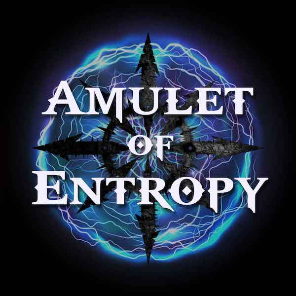

The ***Amulet of Entropy*** was a [HackerBoxes.com](https://hackerboxes.com) project, designed as an indie badge ([#badgelife](https://www.vice.com/en/article/vbne9a/a-history-of-badgelife-def-cons-unlikely-obsession-with-artistic-circuit-boards) baby!) for DEF CON 30 (which is now sadly behind us). If you're still interested, there are a few [HackerBox #0080 kits](https://hackerboxes.com/products/hackerbox-0080-entropy) left - **get them while you can!**

This badge was also used as a research tool for the talk I gave at DEF CON 30 in the Crypto & Privacy Village called "Capturing Chaos: Harvesting Environmental Entropy". See this [README file](research/README.md) for more info.

This project took about 8 months to complete (off and on) and I could not have done it without HackerBoxes. HUGE thanks to Joe for handling all the hard parts (and his infinite patience with my many questions)! If you're the least bit interested in building some fun and educational electronics projects, [subscribe](https://hackerboxes.com/products/hackerbox-monthly-subscription). Just trust me.

I hope to collaborate with HackerBoxes again on future projects like this.

## Project Documentation

* **[Setup](docs/Setup.md)**: How to set up the development environment for this project and get this software running on your HackerBox #0080.
* **[User Guide](docs/UserGuide.md)**: Once you have the software installed, here's how to actually use the amulet.
* **[Customizations](docs/Customize.md)**: Once you've got the stock software running, here are some tips for modifying the software to do more. This project is covered by a liberal [MIT license](LICENSE.md). Enjoy!
* **[To Do](docs/TODO.md)**: I still have plenty of things I want to do with this project, including modifications needed to conduct research for the talk I'll be giving at DEF CON 30 on entropy.
* **[Entropy](docs/Entropy.md)**: If you're interested in the concept of entropy and why it's important for cryptography, you can learn more here.
* **[Contributions](docs/Contrib.md)**: If you'd like to contribute to this project, please see this doc.
* **[Links](docs/Links.md)**: Links to other helpful info and websites related to this project

## Further Info

The docs above have the details you need to build and modify the Amulet of Entropy. To learn more about the project and what I do, see these links:

* **[Firewalls Don't Stop Dragons](https://firewallsdontstopdragons.com/)**. This all started with me writing a [book](https://firewallsdontstopdragons.com/buy-the-book/) about security and privacy for non-technical people, now in its 4th edition. That spawned a [weekly podcast](https://firewallsdontstopdragons.com/podcast/), [blog](https://firewallsdontstopdragons.com/), and [newsletter](https://firewallsdontstopdragons.com/newsletter/new-newsletter/).
* **[HackerBoxes.com](https://hackerboxes.com):** Amazing, fun, educational electronics kits. 
* **[Amulet of Entropy](https://hackerboxes.com/products/hackerbox-0080-entropy):** The official HackerBoxes page for this project/kit (#0080).
* **[Amulet of Entropy podcast](https://podcast.firewallsdontstopdragons.com/):** The podcast episode where we reveal this project, and talk about hardware hacking and the importance of randomness in cryptography.
* **[Understanding Hackers & Hacking](https://podcast.firewallsdontstopdragons.com/2021/08/11/understanding-hackers-hacking/):** If you've never been to DEF CON and/or want to learn more about the hacker mindset, you might check out this podcast where I document my first trip.
* **[On a Dark Tangent](https://podcast.firewallsdontstopdragons.com/2021/08/16/on-a-dark-tangent//):** My fascinating interview with DEF CON founder Jeff Moss (aka Dark Tangent).
