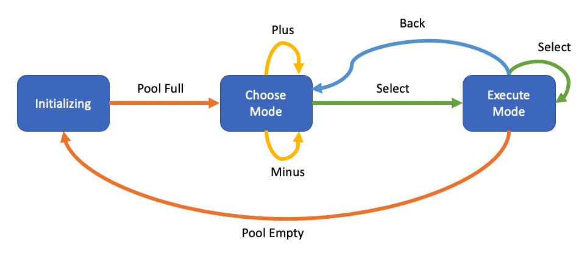

# Contributing

If you'd like to contribute to this project, please read the following carefully.

## Pull Requests

**IMPORTANT!!**

I'm not likely to take pull requests for feature changes. I would strongly prefer that you [fork the primary repo](https://docs.github.com/en/get-started/quickstart/fork-a-repo).

However, if you really think you have an important bug fix or something so cool that everyone should have it as part of the official release, you can submit a PR. However, please read this entire document. Understand the design first.

I have a list of things I still want to do. You can review a short version of this list [here](TODO.md).

## Code Style & Language Choice

I realize the code style is weird and the code is probably not super clean. Twenty years ago, I was really good at C/C++. Since then, I moved on to Java and then python. My code probably looks like python style. So please don't submit style comments. I'm not claiming this is good style.

There's also a mix of styles here because some of this code came from other people. I wasn't going to change that to make it all match.

Before you ask, I tried CircuitPython and MicroPython, and it turns out that it doesn't work for this particular hardware setup. 

## Unit Tests

I should have them and I don't. This was a lazy choice, mostly because I'm just not familiar with C/C++ unit test frameworks and I was short on time. **That** is something that I'd be happy to have someone contribute. Unit tests are essential for any real coding project.

## High Level Design

There are a few key elements to this design. Not saying it's the best design, but this is what I did.

### State Machine

I wanted to represent the system as a simple finite state machine. I found the [tinyfsm](https://digint.ch/tinyfsm/) library and it did the job. You'll find the code mostly in [src/amulet/statemachine.h](../src/amulet/statemachine.h) and [src/amulet/statemachine.cpp](../src/amulet/statemachine.cpp).

The state machine diagram is shown below.

#### Events

There are internal (automatically generated) events and external (user generated) events. The four buttons - **Select**, **Back**, **Plus** and **Minus** - generate the external events. See the [User Guide](UserGuide.md) for info.

The main internal events are **Pool Full** and **Pool Empty**, based on the level of the entropy pool.

#### States

1. **Initializing**: When the entropy pool is completely empty, we stop to refill it. This happens at start up and after the pool is emptied by using it.
2. **Choose Mode**: After the pool is full, you need to choose a mode. The Plus/Minus buttons move you through the list of modes.
3. **Execute Mode**: Once you've chosen a mode, you can repeatedly get new random outcomes by clicking Select. When done, press Back to return to **Choose Mode**. If you drain the entropy pool, and internal event (**Pool Empty**) is generated and you're returned to **Initializing**.

### Singletons

For the main hardware resources, I decided to wrap them in singleton objects to manage access. It's a single-threaded program, but I just wanted to guarantee that there was only one way to access these system resources.

### String vs Char Array

I hate char arrays and all the memory issues that come with them. But the serial monitor routines prefer them and it's a "C thing". So I tried to use `std::string` most places, and converted to `const char []` where necessary.

For debugging, I like giving human-friendly names to objects. So I used a `_name` member variable and a `name()` method to get the character array version using `c_str()`.

### Outcome Numbering

I chose to number the outcomes in the OutcomeMap starting at 1, not 0. I could have started at 0 and used a `vector` instead of a `map`. But for readability and ease of numbering the associated image files, I went with this.

