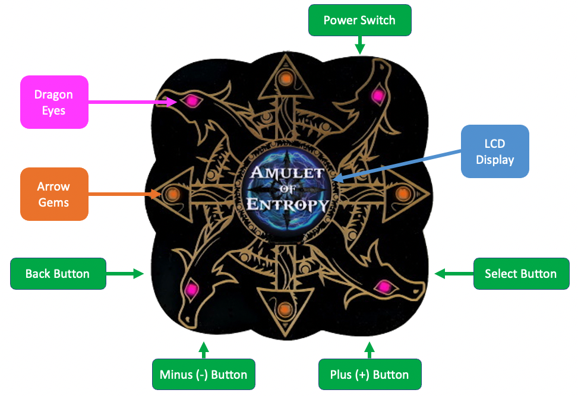

# Amulet User Guide

## User Interface

The Amulet of Entropy's user interface (UI) is pretty simple. See the image below for the inputs and outputs.

### Dragon Eyes

There are four dragon eyes. They indicate how full the pool of entropy is, ranging from green (full) to yellow/orange (partially full) to red (empty).

Note that the dragon heads themselves are supposed to look like arrows, too, per the [chaos symbol](https://en.wikipedia.org/wiki/Symbol_of_Chaos).

### Arrow Gems

There are four gems at the tip of the arrows. These LEDs will sparkle when the entropy pool is full.

### LCD Display

The center display is where the bulk of the action happens. This will show you your mode choices, and then reveal the results when you actually execute the given mode.

### Buttons

There are four tiny buttons on the edge of the bottom PCB:

1. Select
2. Back
3. Plus (+)
4. Minus (-)

### Power Switch

At the top, you'll find a tiny slide switch that toggles between USB and battery modes. (NOTE: You have to provide the battery pack.)

## Entropy Modes

Once the amulet has filled the entropy pool (which it does automatically at start up and whenever the pool is empty), you'll be presented with a choice of modes. You cycle through the mode choices using the **Plus/Minus** buttons, then choose your mode by hitting the **Select** button.

1. Flip a coin
2. Roll a die (d6)
3. Pick a card (standard 52-card deck)
4. Pict a tarot card (standard [Rider-Waite deck](https://en.wikipedia.org/wiki/Rider%E2%80%93Waite_tarot_deck))
5. Magic 8 Ball

Once you select your mode, every time you click **Select**, a new random value will be chosen.

To select a different mode, click **Back** and then use **Plus/Minus** again.

## Entropy Pool Empty

When you use up the pool of entropy, the amulet will pause to collect more entropy. When the pool is again full, you'll be back to the mode choices.

## Demo Mode

I added a 'demo' mode so that you could just watch it cycle through all the modes, pick a few things, and continue.

* **ENTER DEMO:** Press both **Select** and **Back** at the same time
* **EXIT DEMO:** Press **Back** for a second or so